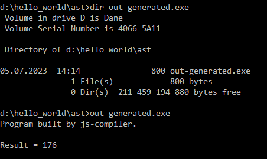
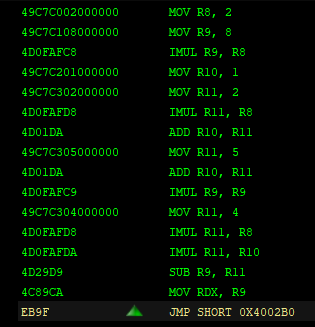

# js-compiler" - syntax highlighting | interpreter | compiler
Why? Because I wanted to make the journey from code to exe file. Js-compiler is a lexer, parser, AST builder, interpreter and exe builder.

It produce very small code

With code without using stack

Try it on page https://slowikk.github.io/js-compiler/
